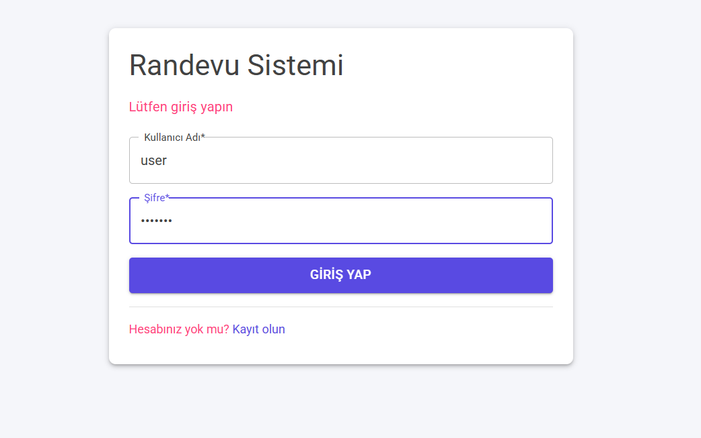
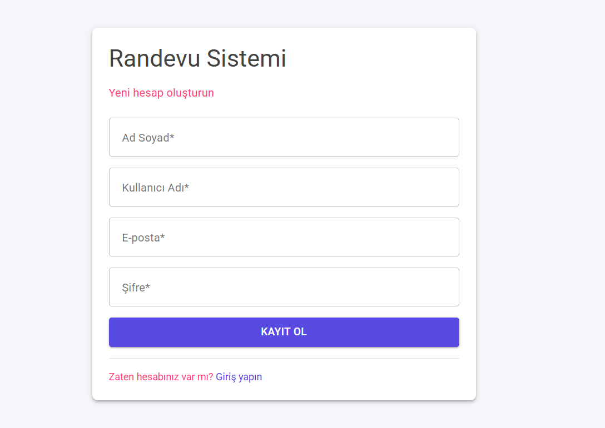
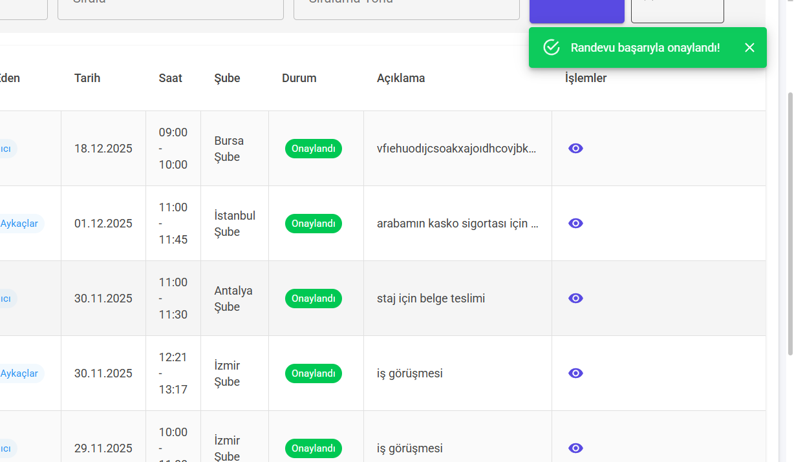
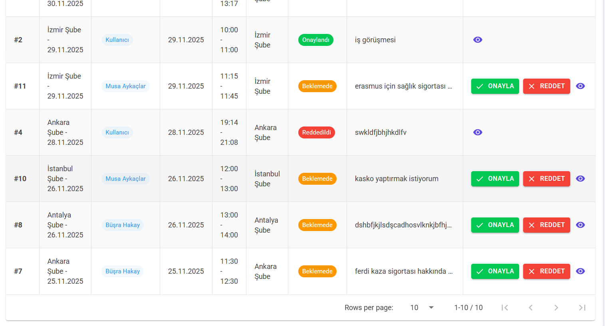
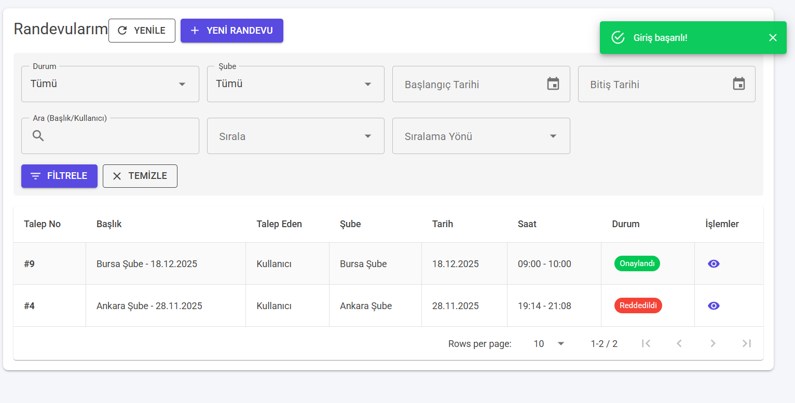
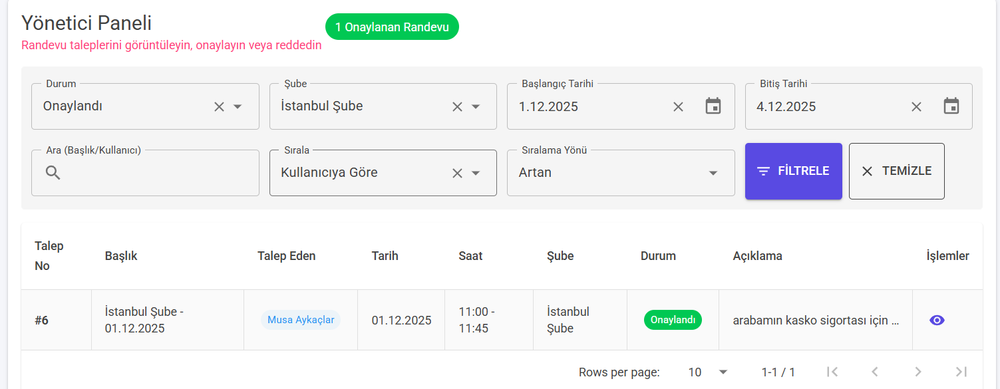
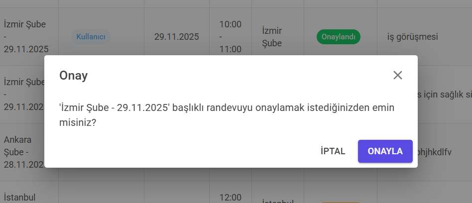

# Randevu Sistemi (Appointment System)

Blazor WebAssembly ve Minimal API kullanılarak geliştirilmiş bir randevu talep, listeleme ve yönetici onay/red akışı uygulaması.

## 📋 Proje Hakkında

Bu proje, kullanıcıların randevu talebi oluşturması ve yöneticilerin bu talepleri onaylaması/reddetmesi için geliştirilmiş bir web uygulamasıdır.

### Özellikler

- ✅ Kullanıcı kayıt ve giriş sistemi
- ✅ Rol tabanlı yetkilendirme (User/Admin)
- ✅ Randevu talep formu (Şube seçimi, tarih/saat, açıklama)
- ✅ Randevu listeleme (Filtreleme, arama, sıralama, sayfalama)
- ✅ Yönetici paneli (Bekleyen talepleri onaylama/reddetme)
- ✅ Detay modalı (Randevu detayları ve audit trail)
- ✅ FluentValidation ile doğrulama
- ✅ Audit trail (Durum değişiklik geçmişi)
- ✅ MudBlazor ile modern UI
- ✅ LocalStorage ile oturum yönetimi

## 🏗️ Mimari

Proje Clean Architecture prensiplerine uygun olarak katmanlı mimari ile geliştirilmiştir:

```
AppointmentSystem/
├── AppointmentSystem.Web/          # Blazor WebAssembly (UI)
├── AppointmentSystem.Api/           # Minimal API (Backend)
├── AppointmentSystem.Application/   # İş mantığı, DTOs, Servisler, Validators
├── AppointmentSystem.Domain/       # Entity'ler, Enum'lar
└── AppointmentSystem.Infrastructure/ # EF Core, DbContext, Migrations
```

### Katmanlar

- **Web**: Blazor WebAssembly UI katmanı
- **API**: Minimal API ile RESTful endpoint'ler
- **Application**: İş mantığı, servisler, DTOs, FluentValidation
- **Domain**: Entity'ler (Appointment, Branch, AppointmentAudit), Enum'lar
- **Infrastructure**: EF Core, DbContext, Migrations, Seed data

## 🛠️ Teknolojiler

- **.NET 8.0**
- **Blazor WebAssembly**
- **Minimal API**
- **Entity Framework Core**
- **PostgreSQL** (veya MSSQL)
- **MudBlazor** (UI Framework)
- **FluentValidation**

## 📦 Kurulum

### Gereksinimler

- .NET 8.0 SDK
- PostgreSQL
- Visual Studio 2022 veya VS Code

### Adımlar

1. **Repository'yi klonlayın:**
```bash
git clone <repository-url>
cd appointment-system
```

2. **Veritabanı bağlantı string'ini yapılandırın:**

Bu proje hassas bilgileri güvenli bir şekilde saklamak için **.NET User Secrets** kullanmaktadır. Bağlantı string'i `appsettings.json` dosyasında placeholder olarak bulunur, gerçek değerler User Secrets'ta saklanır.

**User Secrets ile bağlantı string'ini ayarlayın:**

```bash
cd src/AppointmentSystem.Api
dotnet user-secrets set "ConnectionStrings:DefaultConnection" "Server=localhost;Port=5432;Database=appointmentdb;User Id=postgres;Password=YOUR_PASSWORD"
```

**Not:** `YOUR_PASSWORD` kısmını kendi PostgreSQL şifrenizle değiştirin.

**User Secrets Yönetimi:**

- **Secret'ı görüntülemek için:**
  ```bash
  cd src/AppointmentSystem.Api
  dotnet user-secrets list
  ```

- **Secret'ı güncellemek için:**
  ```bash
  cd src/AppointmentSystem.Api
  dotnet user-secrets set "ConnectionStrings:DefaultConnection" "Yeni_Bağlantı_Stringi"
  ```

- **Secret'ı silmek için:**
  ```bash
  cd src/AppointmentSystem.Api
  dotnet user-secrets remove "ConnectionStrings:DefaultConnection"
  ```

**Önemli:** User Secrets yalnızca geliştirme ortamında kullanılır. Production ortamında environment variables veya Azure Key Vault gibi güvenli yapılandırma yöntemleri kullanılmalıdır.

3. **PostgreSQL veritabanını oluşturun:**
```sql
CREATE DATABASE appointmentdb;
```

4. **API projesini çalıştırın:**
```bash
cd src/AppointmentSystem.Api
dotnet run
```

API çalıştığında otomatik olarak:
- Migration'lar uygulanır
- Seed data oluşturulur (5 şube ve örnek randevu)

5. **WebAssembly projesini çalıştırın:**
```bash
cd src/AppointmentSystem.Web
dotnet run
```

6. **Tarayıcıda açın:**
- Web: `https://localhost:7000` veya `http://localhost:5000`
- API Swagger: `https://localhost:7236/swagger`

## 🔐 Authentication & Kullanıcı Yönetimi

Bu proje basit bir authentication sistemi içermektedir. Kullanıcılar kayıt olabilir ve giriş yapabilir.

### Giriş Yapma

1. Uygulama açıldığında otomatik olarak `/login` sayfasına yönlendirilirsiniz
2. Kullanıcı adı ve şifre ile giriş yapabilirsiniz
3. Hesabınız yoksa `/register` sayfasından kayıt olabilirsiniz

### Varsayılan Kullanıcılar (Seed Data)

Uygulama ilk çalıştırıldığında otomatik olarak 2 kullanıcı oluşturulur:

#### 👤 Kullanıcı (User)
- **Kullanıcı Adı**: `user`
- **Şifre**: `user123`
- **Rol**: Kullanıcı
- **Yetkiler**: 
  - Randevu oluşturma
  - Kendi randevularını görüntüleme
  - Randevu listeleme

#### 👨‍💼 Yönetici (Admin)
- **Kullanıcı Adı**: `admin`
- **Şifre**: `admin123`
- **Rol**: Yönetici
- **Yetkiler**:
  - Tüm randevuları görüntüleme
  - Randevu onaylama/reddetme
  - Yönetici paneli erişimi
  - Randevu detayları ve audit trail görüntüleme

### Kullanıcı Rolleri

- **User (Kullanıcı)**: Normal kullanıcılar, randevu oluşturabilir ve kendi randevularını görüntüleyebilir
- **Admin (Yönetici)**: Yöneticiler, tüm randevuları yönetebilir ve onay/red işlemleri yapabilir

### Yeni Kullanıcı Kaydı

1. `/register` sayfasına gidin
2. Ad Soyad, Kullanıcı Adı, E-posta ve Şifre bilgilerini girin
3. "Kayıt Ol" butonuna tıklayın
4. Kayıt başarılı olduğunda otomatik olarak giriş yapılır ve randevu listesi sayfasına yönlendirilirsiniz

**Not:** Yeni kayıt olan kullanıcılar varsayılan olarak **User** rolüne sahiptir. Admin rolü yalnızca veritabanı üzerinden manuel olarak atanabilir.

### Güvenlik Notları

⚠️ **Önemli**: Bu proje eğitim amaçlıdır ve production için uygun değildir. Şu anda:
- Şifreler hash'lenmemiş olarak saklanmaktadır (gerçek uygulamada BCrypt veya benzeri kullanılmalı)
- Basit token sistemi kullanılmaktadır (gerçek uygulamada JWT kullanılmalı)
- HTTPS zorunluluğu yoktur (production'da mutlaka kullanılmalı)

## 📊 Seed Verisi

Uygulama ilk çalıştırıldığında otomatik olarak:

- **2 Kullanıcı** oluşturulur:
  - **Admin**: `admin` / `admin123` (Yönetici rolü)
  - **User**: `user` / `user123` (Kullanıcı rolü)

- **5 Şube** oluşturulur:
  - İstanbul Şube
  - Ankara Şube
  - İzmir Şube
  - Bursa Şube
  - Antalya Şube

- **1 Örnek Randevu** oluşturulur (Pending durumunda)

## 🎯 Kullanım Senaryoları

### 🔑 Giriş Yapma

1. Uygulama açıldığında `/login` sayfasına yönlendirilirsiniz
2. Kullanıcı adı ve şifre ile giriş yapın:
   - **Kullanıcı**: `user` / `user123`
   - **Yönetici**: `admin` / `admin123`
3. Giriş başarılı olduğunda rolünüze göre yönlendirilirsiniz:
   - **Kullanıcı** → `/appointments` (Randevu Listesi)
   - **Yönetici** → `/admin-appointments` (Yönetici Paneli)

### 👤 Kullanıcı (Müşteri/Personel) İşlemleri

#### Randevu Oluşturma
1. Giriş yaptıktan sonra **Randevu Talep Formu** sayfasına gidin (`/appointment-form`)
2. Şube seçin (dropdown'dan 5 şube arasından)
3. Tarih ve saat bilgilerini girin
4. Açıklama ekleyin (opsiyonel)
5. "Gönder" butonuna tıklayın
6. Randevu **Pending** durumuna geçer ve yönetici onayı bekler

#### Randevu Listeleme
1. **Randevu Listesi** sayfasında (`/appointments`) kendi randevularınızı görüntüleyin
2. Durum, tarih aralığı ve arama ile filtreleyin
3. Tarih veya duruma göre sıralayın
4. Sayfalama ile gezinin (10/25/50 kayıt)
5. Randevu detaylarını görüntülemek için randevuya tıklayın

### 👨‍💼 Yönetici İşlemleri

#### Randevu Onaylama/Reddetme
1. **Yönetici Paneli** sayfasına gidin (`/admin-appointments`)
2. Bekleyen (Pending) randevu taleplerini görüntüleyin
3. Her randevu için:
   - **Onayla**: Randevuyu onaylar (Approved durumuna geçer)
   - **Reddet**: Red nedeni girerek reddeder (Rejected durumuna geçer - açıklama zorunlu)
4. Onaylanan veya reddedilen randevular listeden kaldırılır

#### Randevu Yönetimi
- Tüm randevuları görüntüleyin (tüm kullanıcıların randevuları)
- Filtreleme, arama ve sıralama yapın
- Randevu detaylarını ve audit trail (durum değişiklik geçmişi) görüntüleyin
- Randevu durumlarını takip edin

### 📋 Randevu Listesi Özellikleri

- **Filtreleme**: Durum, tarih aralığı, şube, kullanıcı
- **Arama**: Randevu başlığı ve açıklamasında arama
- **Sıralama**: Tarih, durum, oluşturulma tarihi
- **Sayfalama**: 10/25/50 kayıt per sayfa
- **Detay Görüntüleme**: Randevu detayları ve audit trail modalı

## 📝 API Endpoints

### Authentication
- `POST /api/auth/login` - Kullanıcı girişi
- `POST /api/auth/register` - Yeni kullanıcı kaydı
- `GET /api/auth/me` - Mevcut kullanıcı bilgileri

### Branches
- `GET /api/branches` - Tüm şubeleri listele
- `GET /api/branches/{id}` - Şube detayı

### Appointments
- `GET /api/appointments` - Randevuları listele (filtreleme, sayfalama)
- `GET /api/appointments/pending` - Bekleyen randevular
- `GET /api/appointments/{id}` - Randevu detayı
- `GET /api/appointments/{id}/audits` - Randevu audit geçmişi
- `POST /api/appointments` - Yeni randevu oluştur
- `PUT /api/appointments/{id}` - Randevu güncelle
- `POST /api/appointments/{id}/approve` - Randevu onayla
- `POST /api/appointments/{id}/reject` - Randevu reddet

## ✅ Doğrulama Kuralları

- **Şube**: Zorunlu
- **Talep Tarihi**: Bugünden önce olamaz
- **Başlangıç Saati**: Zorunlu
- **Bitiş Saati**: Başlangıç saatinden sonra olmalı
- **Red Nedeni**: Reddetme işleminde zorunlu

## 🔄 Durum Akışı

```
Draft → Pending → Approved
                ↘ Rejected
```

- **Draft**: Yeni kayıt oluşturulurken
- **Pending**: Kullanıcı talebi gönderdiğinde
- **Approved**: Yönetici onayladığında
- **Rejected**: Yönetici reddettiğinde (açıklama zorunlu)

## 🐛 Hata Yönetimi

- FluentValidation ile alan bazlı doğrulama
- Toast/Snackbar bildirimleri (başarılı/hatalı işlemler)
- Global hata yönetimi

## 📸 Ekran Görüntüleri

### 1. Giriş Sayfası


### 2. Kayıt Ol Sayfası


### 3. Randevu Talep Formu


### 4. Randevu Gönderildi


### 5. Randevu Listesi


### 6. Kullanıcı Randevuları


### 7. Randevu Filtreleme


### 8. Randevu Detayları


### 9. Yönetici Paneli


### 10. Randevu Onaylama


### 11. Randevu Reddetme


### 12. Randevu Talebi


## 🚀 Geliştirme

### Migration Oluşturma

```bash
cd src/AppointmentSystem.Infrastructure
dotnet ef migrations add MigrationName --startup-project ../AppointmentSystem.Api
```

### Migration Uygulama

```bash
cd src/AppointmentSystem.Api
dotnet ef database update
```

## 📄 Lisans

Bu proje eğitim amaçlı geliştirilmiştir.

## 👨‍💻 Geliştirici Notları

- Proje .NET 8.0 ile geliştirilmiştir
- PostgreSQL veritabanı kullanılmıştır (MSSQL'e değiştirilebilir)
- MudBlazor 8.14.0 kullanılmıştır
- FluentValidation 11.10.0 kullanılmıştır

---

**Not:** Bu proje bir örnek uygulamadır ve production için ek güvenlik önlemleri alınmalıdır.
